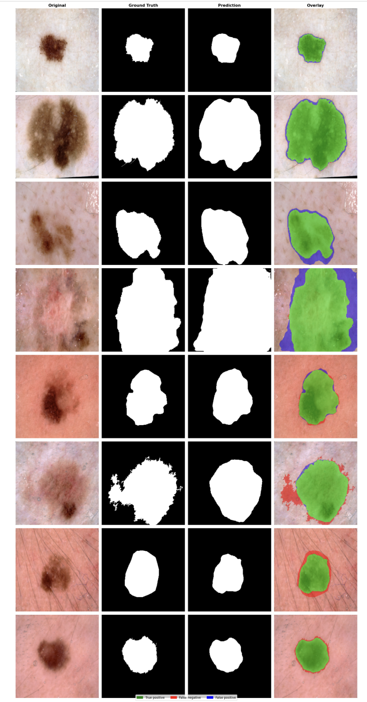
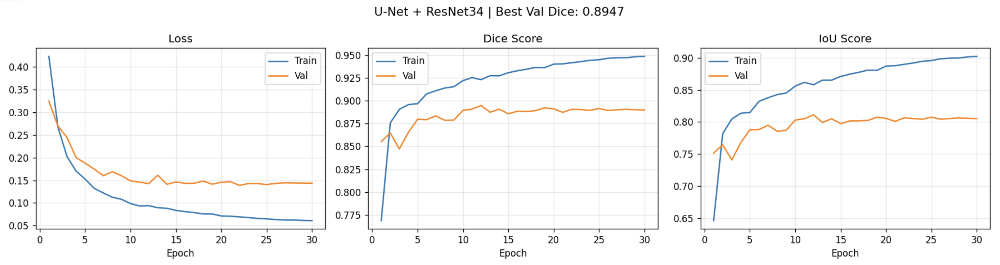

# Skin Lesion Segmentation with U-Net + ResNet34

<p align="center">
  
</p>

<p align="center">
  
  
  
  
  
</p>

> Binary segmentation of dermoscopic skin lesion images using U-Net with a pretrained ResNet34 encoder, trained on the ISIC 2018 dataset. Achieves **Val Dice 0.8902** in 30 epochs.

---

## What This Project Does

Given a dermoscopy image of skin, the model draws a precise pixel-level mask around the lesion — telling you **where** the lesion is, not just **if** one exists.

This is a step beyond classification and is closer to what real clinical AI systems need to do. Early and accurate lesion boundary detection helps dermatologists:
- Measure lesion size and growth over time
- Flag suspicious regions for urgent review
- Reduce diagnostic workload

---

## Results

| Metric | Scratch U-Net (10 epochs) | **ResNet34 U-Net (30 epochs)** |
|--------|--------------------------|-------------------------------|
| Val Dice (DSC) | 0.7804 | **0.8902** |
| Val IoU (Jaccard) | 0.7257 | **0.8044** |
| Encoder | None (from scratch) | ResNet34 (ImageNet pretrained) |
| Training time | ~50 min | ~2.5 hrs (Kaggle T4) |

### Training Curves


Loss drops consistently across 30 epochs. Train and val Dice scores track closely — no overfitting — showing the augmentation pipeline is working well.

### Prediction Overlay


Each row: **Original** | **Ground Truth** | **Prediction** | **Overlay**

- 🟢 **Green** = True positive (correctly segmented lesion)
- 🔴 **Red** = False negative (missed lesion area)  
- 🔵 **Blue** = False positive (over-predicted boundary)

Most predictions closely follow the ground truth boundary across varied lesion shapes, sizes, and skin tones.

---

## Architecture: U-Net + ResNet34

```
Input (3 × 256 × 256)
        │
[ResNet34 Encoder] ← pretrained on ImageNet
   Layer 1: 64 channels  ──────────────────────────────┐
   Layer 2: 128 channels ───────────────────────────┐  │
   Layer 3: 256 channels ────────────────────────┐  │  │
   Layer 4: 512 channels ─────────────────────┐  │  │  │
        │                                     │  │  │  │
   [Bottleneck]                               │  │  │  │
        │                                     │  │  │  │
[Decoder] ← skip connections ─────────────────┘──┘──┘──┘
   Upsample + Concat → Conv 256
   Upsample + Concat → Conv 128
   Upsample + Concat → Conv 64
   Upsample + Concat → Conv 32
        │
   1×1 Conv → Sigmoid
        │
Output (1 × 256 × 256) — binary mask
```

**Why ResNet34?** A pretrained encoder already knows edges, textures, and shapes from ImageNet — it only needs to learn medical-specific patterns on top. This is why it scores significantly higher than a scratch-trained U-Net (0.89 vs 0.78).

**Skip connections** pass fine-grained spatial detail from the encoder directly to the decoder, preserving sharp lesion boundaries that would otherwise be lost during downsampling.

---

## Dataset: ISIC 2018 Task 1

| Property | Value |
|----------|-------|
| Source | [ISIC Archive 2018](https://challenge.isic-archive.com/data/#2018) |
| Images | 2,594 dermoscopic RGB images (.jpg) |
| Masks | Binary segmentation masks (.png) |
| Split | 85% train / 15% val |
| Image size | 256 × 256 |

---

## Loss Function

Combined **BCE + Dice Loss**:

```
Loss = 0.5 × BCEWithLogits + 0.5 × DiceLoss
```

- **BCE** handles pixel-level accuracy
- **Dice** handles overlap quality — critical for imbalanced masks where lesion pixels are far fewer than background

---

## Setup

```bash
git clone https://github.com/minthukyaw488-commits/skin-lesion-segmentation
cd skin-lesion-segmentation
pip install -r requirements.txt
```

### Data Structure

```
data/
├── images/
│   ├── ISIC_0000000.jpg
│   └── ...
└── masks/
    ├── ISIC_0000000_segmentation.png
    └── ...
```

Download from [ISIC 2018 Task 1](https://challenge.isic-archive.com/data/#2018).

---

## Training

**Local:**
```bash
cd src
python train.py
```

**Kaggle (recommended — free T4 GPU):**
- Upload `kaggle_notebook.py` to a new Kaggle notebook
- Add ISIC 2018 dataset as input
- Enable GPU T4 accelerator
- Run all cells

---

## Inference Example

```python
from PIL import Image
import torch
import torchvision.transforms as T
import segmentation_models_pytorch as smp

# Load model
device = torch.device("cuda" if torch.cuda.is_available() else "cpu")
model  = smp.Unet(
    encoder_name="resnet34",
    encoder_weights=None,
    in_channels=3, classes=1, activation=None
).to(device)

ckpt = torch.load("results/best_model.pth", map_location=device)
model.load_state_dict(ckpt["model_state"])
model.eval()

# Preprocess
image = Image.open("your_image.jpg").convert("RGB")
transform = T.Compose([
    T.Resize((256, 256)),
    T.ToTensor(),
    T.Normalize([0.485, 0.456, 0.406], [0.229, 0.224, 0.225])
])
tensor = transform(image).unsqueeze(0).to(device)

# Predict
with torch.no_grad():
    logits = model(tensor)
    mask   = (logits.sigmoid() > 0.5).float()

print(f"Lesion area: {mask.mean().item()*100:.1f}% of image")
```

---

## Project Structure

```
skin-lesion-segmentation/
├── src/
│   ├── model.py         ← Scratch U-Net architecture
│   ├── dataset.py       ← ISIC dataset loader + augmentation
│   ├── losses.py        ← Dice loss, BCE+Dice, IoU metric
│   ├── train.py         ← Training loop with checkpointing
│   └── evaluate.py      ← Evaluation + overlay visualization
├── assets/
│   ├── training_curves.png
│   └── overlay_grid.png
├── results/
│   └── best_model.pth   ← Trained model weights
├── kaggle_notebook.py   ← Full Kaggle training script
├── app.py               ← Gradio demo
├── requirements.txt
├── CONTRIBUTING.md
├── LICENSE
└── README.md
```

---

## Key Concepts Learned

- **U-Net encoder–decoder** with skip connections for boundary preservation
- **Pretrained encoder** (ResNet34) vs training from scratch — impact on performance
- **Dice loss** vs BCE — why segmentation needs overlap-aware losses
- **Mask-consistent augmentation** — flipping/rotating image AND mask together
- **IoU and Dice** as evaluation metrics for segmentation tasks
- **Overlay visualization** to diagnose TP / FN / FP model behavior

---

## Future Improvements

- Try stronger encoders: EfficientNet-B4, Swin-T → target 0.91+ Dice
- Add attention gates to the decoder
- Test-time augmentation (TTA) for better inference
- Deploy on Hugging Face Spaces with Gradio demo
- Train on ISIC 2019/2020 for more generalization

---

## Citation

If you use this project, please cite the ISIC 2018 dataset:

```
HAM10000 Dataset: (c) by ViDIR Group, Department of Dermatology,
Medical University of Vienna
https://doi.org/10.1038/sdata.2018.161
```

---

## Author

**NOVEM (MIN THU KYAW)**  
Medical AI · Konyang University, Daejeon, South Korea  
